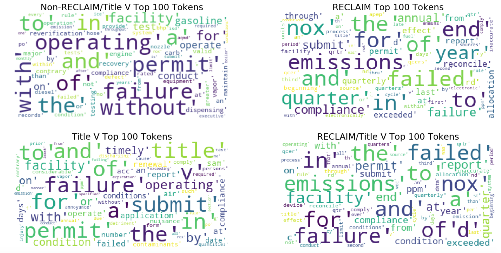
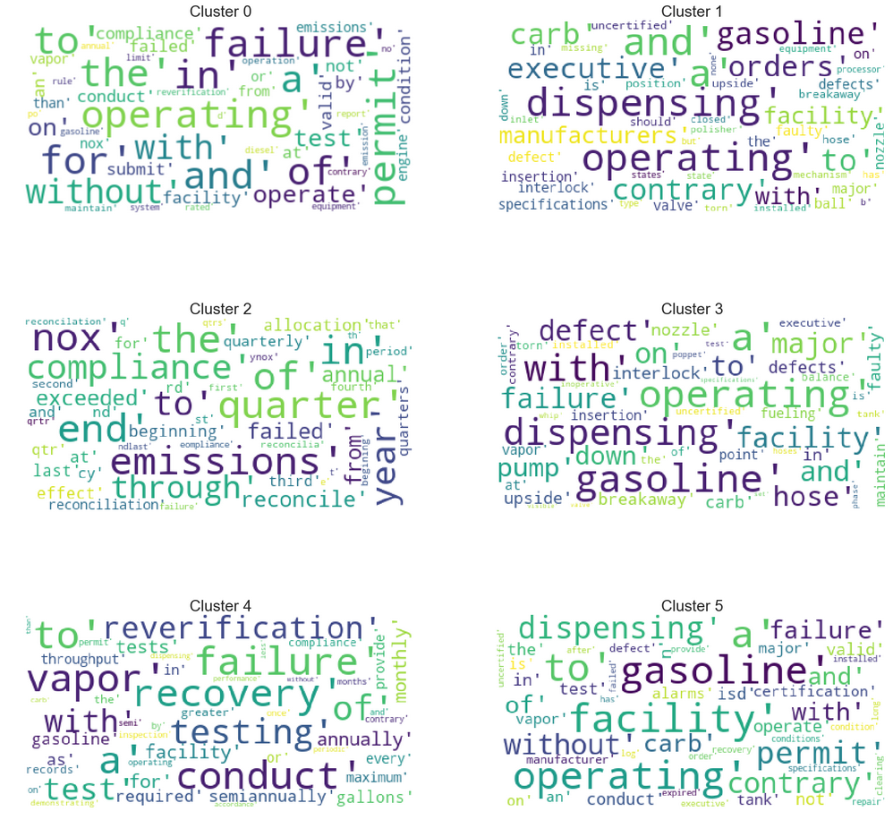
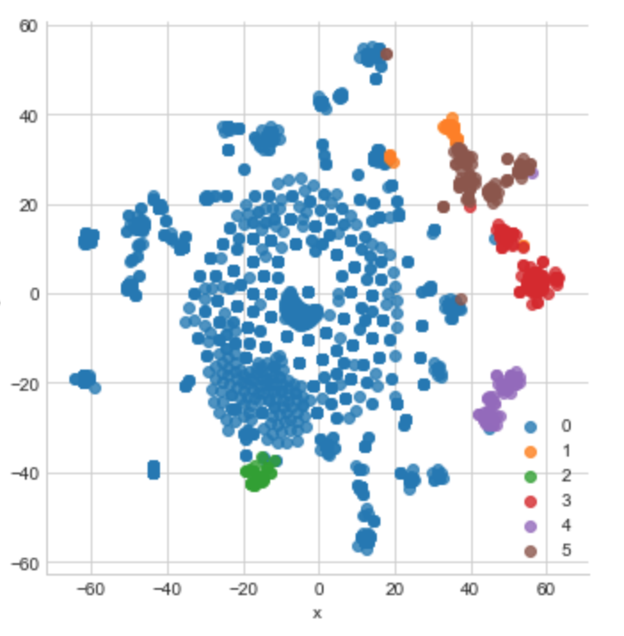
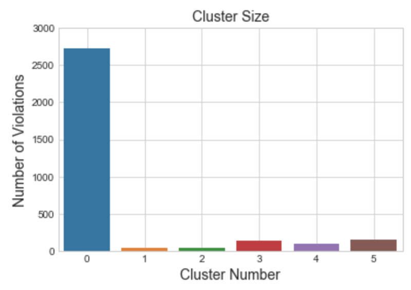

# K-Means Clustering of 3,500+ Violations Issued by the South Coast Air Quality Management District (SCAQMD)

The [South Coast Air Quality Management District](https://www.enveraconsulting.com/what-is-the-scaqmd/) is the local regulatory agency for most of Southern California.

As part of their core function, the AQMD ensures that all stationary sources of air emissions comply with all of the applicable rules.  This includes various state, federal and local air pollution control rules/regulations.

The AQMD has various programs in place to ensure that stationary sources comply with all applicable regulations.  These include:

* Air quality permitting
* Implementation of the Federal Title V program
* Regional Clean Air Market Incentives (RECLAIM) program
* Compliance inspections

The AQMD has more than 25,000 facilities under their jurisdiction.

## The Inspection Process

During the inspection process, an inspector will show up to a given facility and look at the equipment, permits, and records that the facility may have.  In general, the inspector is there to verify that all conditions are being met and rule compliance is being achieved. 

In the event if the inspector finds issues of non-compliance, they can take one of two actions.

First, they can issue a notice to comply (NTC), which is effectively like a fix-it-ticket.  To resolve an NTC, the facility will need to make the proper adjustments as noted by the inspector and notify the AQMD that the changes have been made. There isn't a fine associated with a notice to comply.

Second, they can issue a notice of violation.  Notices of violations 
 (NOV) are not serious than an NTC, and can include heavy fines and legal action. Depending on the situation, the fines issued by the AQMD can be up to $1 million per day per violation. 

## Project Overview

As part of this project, we sought to cluster, using k-means, more than 3,500 NOV issued by the AQMD. 

By clustering the data, we sought to find patterns or natural groupings in the dataset that may not be apparent from just looking at the data on its face. The identification of clusters in the data can be used by our customers in order better understand the most common regulations that the AQMD issues violations for. 

The data for this project was obtained via web scraping of the AQMD's website.  In addition, we also scraped all of the facility ID numbers for facilities in the Title V, RECLAIM and RECLAIM/Title V compliance programs.  This second data set was then combined with the initial list of violations to label each facility  in terms of the type of facility. 

The general approach for this project included the following steps:

* Developing the business problem
* Obtain the data
* Clean/pre-process the data
* Creating initial plots of the data
* Clustering the data using k-means
* Plotting the data
* Analyzing results
* Discussion the results

As a whole, this project can be considered to be an end-to-end project since it involved the entire data analysis workflow. 

## Key Take Aways

**First.** From a review of the top 100 tokens from each of the four types of facilities, you can see that the distribution of the tokens in each facility type, generally makes sense. 

For example, some of the most common tokens from the RECLAIM violations include `emissions`, `quarter`, `compliance`, `nox`.  All of these make sense, since we have seen all of these tokens are used to describe RECLAIM violations from past projects.

When it comes to some of the the top Title V tokens, it's clear that we see `facility`, `permit`, `submit`, `title`, `failure`. Again we have seen all of these tokens on actual violations from past clients in the Title V program.

**Second.** From the work completed (elbow and silhouette methods) to determine the optimal number of clusters, we find that six clusters is best. 

When looking at a word cloud of the top 100 tokens in each cluster, a few items stand out.  First, violations related to gasoline dispensing are quite common (see clusters, 1, 3, 4, and 5).  In addition, the tokens `gasoline`, `dispensing`, and `operating` are quite common in clusters, 1, 3, and 5.  When looking at the word clouds for Cluster 4, we see that violations related to reverification tests required under [SCAQMD Rule 461](http://www.aqmd.gov/docs/default-source/rule-book/rule-iv/rule-461.pdf) are common as noted by the tokens `failure`, `conduct`, `recovery`, `vapor`, and `reverification`. 

Second, Cluster 2 seems to be related to RECLAIM violations since all of these tokens are ones that we have heard used when dealing with non-compliance at a RECLAIM facility.

Third Cluster 0 seems to be a catch all for all of the other violations that are not related to gasoline dispensing or the RECLAIM program.

Here is an initial attempt at visualizing the clusters.  These results needed to be charted after using tSNE since the initial data set had 93 features.  To reduce the dimensionality down to two, I used tSNE.

In this chart, cluster 0 contains the most of the data and also contains many unique violations, as compared to the other groups. Again, we call this cluster the "catch all."

In addition, from this chart, we see that clusters 1, 3, 4, and 5 seem to be closer in proximity than say, cluster 2. This makes sense since cluster 2 are violations seem to be center around the RECLAIM program.

The disparity that is show in the plot of clusters is also substianted from the bar chart below.

## Text Processing
Free form text data tends to be inherently dirty.  As part of this project, we cleaned the data using the following approach.

1. Corrected incorrect facility ID numbers.
2. Corrected incorrect notice of violation numbers.
3. Removed punctuations and digits.
4. Made all of the text data lower case. 

## Future Work

Future work related this this project can include re-clustering the data using only the violations included in Cluster 0 since that cluster has the most entries and is quite possibly a catch all since it contains the most number of unique violations in the dataset.

## Misc References Used For This Project

* https://medium.com/@luckylwk/visualising-high-dimensional-datasets-using-pca-and-t-sne-in-python-8ef87e7915b
* http://scikit-learn.org/stable/modules/manifold.html#t-sne
* http://jmlr.org/papers/volume9/vandermaaten08a/vandermaaten08a.pdf
* https://www.kaggle.com/thykhuely/mercari-interactive-eda-topic-modelling
* https://www.dataquest.io/blog/build-a-data-science-portfolio/
* https://www.youtube.com/watch?v=NEaUSP4YerM
* http://scikit-learn.org/stable/auto_examples/cluster/plot_kmeans_silhouette_analysis.html
* https://www.stat.berkeley.edu/~spector/s133/Clus.html
* https://stats.stackexchange.com/questions/10540/how-to-interpret-mean-of-silhouette-plot

***
