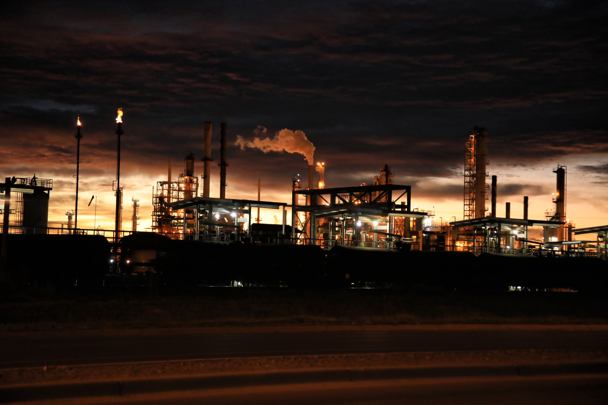

# Project Outline:  Clustering Notice of Violation Data from the South Coast Air Quality Management District (AQMD)

Repo Location: [Github Link](https://github.com/grantaguinaldo/AQMD_violation_classification)

##Find summary statistics of the dataset.
*	Chart histogram of all of the settlement costs.
*	Chart histogram of all of all of the settlement costs by facility types.
*	Chart using box/whisker plot, all of the settlement costs by facility types.
*	Chart bar chart of the total number of violations by facility type.
*	Chart the average settlement costs by the length of violation.

##Deal with outliers in the dataset.
* Remove and replace outlier settlement costs and entries.  Figure out how to replace the values in the dataset. 

##Write out the objective of the study
*	What are we trying to achieve? Trying to build a model that can predict the settlement cost of a **NOV** simply from the text of the violation and other features.
* 	Introduction to the AQMD, and what does the data represent.
*  Explain how we obtained the data for the study.
*  Set up the problem statement for the reader. 

##Word Clouds
* Create word clouds for the violations in each facility type.
* Create word clouds for the violations in each cluster type (after applying k-means)

##Dimensionality reduction
* Use tSNE to reduce the data to a two-dimensional data set for plotting.

##Cluster using k-Means
* Once the dataset has been reduced, cluster using k-means, plot, and color code to identify clusters.

##Other
* Take existing clustering, and further refine cluster number 1 to see what trends can be identified in the data. 
* Can we take the clusters and do linear regression on the data to predict the settlement cost?

***